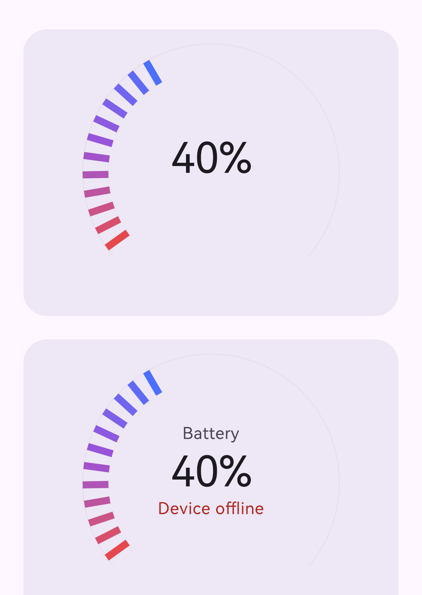

# ArcProgressView

A Jetpack Compose arc/gauge progress indicator — a segmented gauge with a gradient sweep of
radial ticks, a faint full-sweep track, and an optional label/status pair around the value (e.g.
a battery readout with an offline status).



## Features

- Pure Compose `Canvas` drawing — no `View`/XML, no custom view inflation.
- Configurable arc geometry: `startAngle`, `sweepAngle` (defaults to a 260° gauge), track and
  segment thickness/length.
- Gradient segment fill — pass any list of `Color`s and they're interpolated across the lit
  segments.
- Animated progress (`animateFloatAsState`) — segments fill in and the value counts up smoothly
  on every progress change.
- Optional `label` (above) and `statusText` (below) around the value, each independently
  styleable, or `null` to hide.
- One-line typography override via `fontFamily`, or full per-line control via
  `labelStyle` / `valueStyle` / `statusStyle`.
- Custom value formatting via `valueFormatter` (defaults to a `"NN%"` string).

## Module layout

| Module | Purpose |
| --- | --- |
| `:library` | The publishable Compose library (`com.mirzamadil.customarc`) |
| `:app` | Demo app showcasing the composable interactively |

## Requirements

- minSdk 24, compileSdk 37
- Jetpack Compose (BOM `2026.02.01` or compatible) + Material 3

## Installation

### Maven Central

```kotlin
// app/build.gradle.kts
dependencies {
    implementation("io.github.mirza-adil:arcprogressview:1.0.0")
}
```

> Publishing is configured (see `library/build.gradle.kts`) but the first release hasn't been
> pushed to Maven Central yet. Until then, use the local module include below.

### Local module (until the first release is published)

```kotlin
// settings.gradle.kts
include(":library")
project(":library").projectDir = file("path/to/ArcProgressView/library")
```

```kotlin
// app/build.gradle.kts
dependencies {
    implementation(project(":library"))
}
```

## Usage

### Basic

```kotlin
ArcProgressView(
    progress = 40f,
    modifier = Modifier
        .fillMaxWidth()
        .height(220.dp),
)
```

### With label and status

```kotlin
ArcProgressView(
    progress = batteryLevel,
    label = "Battery",
    statusText = if (deviceOffline) "Device offline" else null,
    modifier = Modifier
        .fillMaxWidth()
        .height(220.dp),
)
```

### Custom colors and typography

```kotlin
ArcProgressView(
    progress = progress,
    segmentColors = listOf(Color(0xFF00BFA5), Color(0xFF00ACC1), Color(0xFF3F51B5)),
    fontFamily = FontFamily.Serif,
    modifier = Modifier
        .fillMaxWidth()
        .height(220.dp),
)
```

## Parameters

| Parameter | Default | Description |
| --- | --- | --- |
| `progress` | — | Current value (required) |
| `maxProgress` | `100f` | Value representing 100% |
| `startAngle` / `sweepAngle` | `140f` / `260f` | Arc geometry in degrees (Compose's `drawArc` convention: 0° = 3 o'clock, clockwise) |
| `trackColor` / `trackStrokeWidth` | `colorScheme.surfaceVariant` / `1.dp` | The faint full-sweep background arc |
| `segmentCount` | `30` | Number of radial ticks across the full sweep |
| `segmentThickness` / `segmentLength` | `6.dp` / `22.dp` | Tick stroke width / radial length |
| `segmentColors` | red → purple → blue | Gradient interpolated across the lit ticks |
| `fontFamily` | `null` | Applies one font to label/value/status text |
| `label` / `labelStyle` / `labelColor` | `null` | Optional line above the value |
| `valueStyle` / `valueColor` / `valueFormatter` | `displaySmall` / `onSurface` / `"NN%"` | The main value text |
| `statusText` / `statusStyle` / `statusColor` | `null` / `bodyMedium` / `colorScheme.error` | Optional line below the value |
| `animationSpec` | `tween(900ms, FastOutSlowInEasing)` | Animation used when `progress` changes |

## Demo app

Run the `:app` module for an interactive playground: progress slider, color palette picker,
typography picker, dynamic card color/size, and a horizontally scrollable list of gauges.

## License

```
Apache License, Version 2.0 — see LICENSE for the full text.
Copyright 2026 Mirza Adil
```

## Author

**Mirza Adil**
[LinkedIn](https://www.linkedin.com/in/mirzaadil/)
